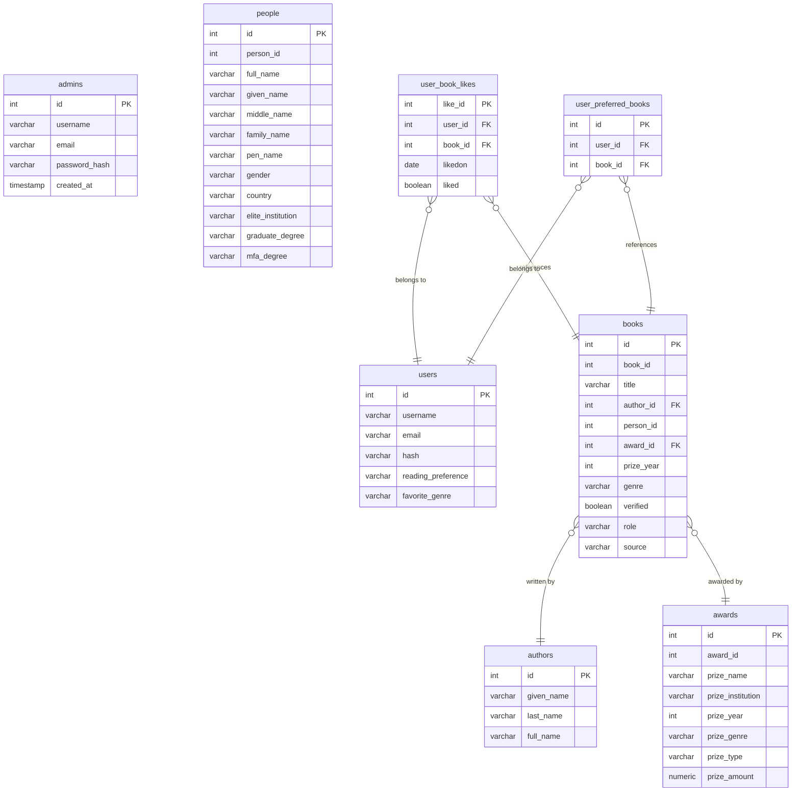

# Look Up Book

**Look Up Book** is a full-stack web application for exploring, tracking, and managing award-winning books. Registered users can browse a curated database of literary award winners, save books to their personal reading profile, search by author or award, like/dislike books, and submit new books for admin review. Administrators have all user privileges plus can verify user submissions, delete books, and access a dedicated verification dashboard.

---

## Table of Contents

- [Features](#features)
- [Tech Stack](#tech-stack)
- [Application Pages](#application-pages)
- [REST API Reference](#rest-api-reference)
- [Database Schema (ERD)](#database-schema-erd)
- [Prerequisites](#prerequisites)
- [Installation](#installation)
- [Environment Variables](#environment-variables)
- [Running the Application](#running-the-application)
- [Contributing](#contributing)
- [License](#license)

---

## Features

- **User authentication** — register, log in, and receive a JWT for all authenticated requests.
- **Admin authentication** — separate admin register/login flow; admin accounts are automatically linked to a `users` row so admins can use every user-facing feature.
- **Homepage** — paginated list of award-winning books with like/dislike controls per book.
- **Search by author** — find all award-winning books for any given author.
- **Search by award** — browse every book associated with a specific literary prize.
- **Add Book from Database** — pick any award-winning book from the master catalogue and save it directly to a personal profile.
- **Submit a new book** — users can propose new award-winning titles; submissions are held in a pending queue until an admin approves them.
- **Admin Verification dashboard** — (admin only) review pending submissions, approve or reject them, and delete verified submissions.
- **Profile page** — view and update reading preferences (reading preference, favourite genre) and manage the personal saved-book list (add / remove).

---

## Tech Stack

| Layer | Technology |
|---|---|
| Frontend | React 18, React Router v6 |
| Backend | Node.js, Express 4 |
| Database | PostgreSQL |
| Auth | JSON Web Tokens (jsonwebtoken), bcrypt |
| DB client | node-postgres (`pg`) |
| Config | dotenv |

---

## Application Pages

| Route | Component | Access |
|---|---|---|
| `/` | — | Redirects to `/homepage` (authenticated) or `/login` |
| `/login` | `LoginSignup` | Public — sign up, log in (user or admin) |
| `/homepage` | `Homepage` | Authenticated users & admins |
| `/add-db-book` | `AddDbBook` | Authenticated users & admins |
| `/add-new-book` | `AddNewBook` | Authenticated users & admins |
| `/admin-verification` | `AdminVerification` | **Admin only** |
| `/search-books` | `SearchBooks` | Authenticated users & admins |
| `/search-awards` | `SearchAwards` | Authenticated users & admins |
| `/profile` | `Profile` | Authenticated users & admins |

---

## REST API Reference

All endpoints are served by the Express backend on port **5000**.  
Routes marked **[auth]** require a valid JWT in the `Authorization: Bearer <token>` header.  
Routes marked **[admin]** require a JWT with `isAdmin: true`.

### Authentication

| Method | Endpoint | Description |
|---|---|---|
| `POST` | `/signup` | Register a new user; returns `{ token, userId, username }` |
| `POST` | `/login` | Log in as a user; returns `{ token, userId, username }` |
| `POST` | `/admin/register` | Register a new admin account; returns `{ token, adminId, userId, username, email }` |
| `POST` | `/admin/login` | Log in as an admin; returns `{ token, adminId, userId, username, email }` |
| `GET` | `/admin/profile-user` | [admin] Resolve (or create) the linked `users` row for the current admin; returns `{ userId }` |

### Books & Authors

| Method | Endpoint | Description |
|---|---|---|
| `GET` | `/api/tableName` | All award-winning books for the Homepage (unfiltered) |
| `GET` | `/api/authors` | List all authors |
| `GET` | `/api/books/:authorId` | All books for a given author |
| `GET` | `/api/books-for-profile` | Full catalogue of award-winning books for the Add-from-DB page |
| `GET` | `/api/search-books-award-winners` | Award-winning books for the Search page, one row per award |
| `POST` | `/api/like` | [auth] Like or dislike a book (`{ bookId, liked }`) |

### Awards

| Method | Endpoint | Description |
|---|---|---|
| `GET` | `/api/awards` | List all awards |
| `GET` | `/api/book-awards` | List all award names (used to populate the submission form) |
| `GET` | `/api/awards/:awardId` | Details for a single award |

### Book Submissions (User)

| Method | Endpoint | Description |
|---|---|---|
| `POST` | `/api/submit-book` | [auth] Submit a new book for admin review |

### Admin Verification

| Method | Endpoint | Description |
|---|---|---|
| `GET` | `/api/is-admin/:userId` | [admin] Check whether a `userId` belongs to an admin |
| `GET` | `/api/unverified-books` | [admin] List all pending (unverified) book submissions |
| `PATCH` | `/api/books/:bookId/verification` | [admin] Approve (`{ verified: true }`) or reject a submission |
| `GET` | `/api/verified-submitted-books` | [admin] List all approved user submissions |
| `DELETE` | `/api/admin/books/:bookId` | [admin] Permanently delete a submitted book |

### User Profile

| Method | Endpoint | Description |
|---|---|---|
| `GET` | `/api/user/preference/:userId` | [auth, self or admin] Get reading preferences for a user |
| `POST` | `/api/user/preference/update` | [auth, self or admin] Update reading preferences (`reading_preference`, `favorite_genre`) |
| `GET` | `/api/user/:userId/preferred-books` | [auth, self or admin] Get the user's saved book list |
| `POST` | `/api/user/add-book` | [auth, self or admin] Add a book to the user's saved list |
| `POST` | `/api/user/remove-book` | [auth, self or admin] Remove a book from the user's saved list |

---

## Database Schema (ERD)



> **Notes:**
> - `admins` and `users` are separate tables. When an admin registers or logs in, the server automatically finds or creates a matching `users` row (keyed on the admin's email) so the admin can use all user-facing features (profile, saved books, etc.).
> - `people` is a reference table that stores rich biographical metadata about authors imported from external award datasets; `books.person_id` may reference a `people` record for enriched author data.
> - `user_book_likes` has a unique constraint on `(user_id, book_id)` — one like/dislike per user per book.
> - `users.username` and `users.email` each have a `UNIQUE` constraint.

---

## Prerequisites

- **Node.js** v16 or later
- **npm** v8 or later
- **PostgreSQL** v13 or later

---

## Installation

Clone the repository:

```bash
git clone https://github.com/ZABocek/Springboard_Capstone_Project_2_Look_Up_Book.git
cd Springboard_Capstone_Project_2_Look_Up_Book
```

### Server setup

```bash
cd server
npm install
```

### Client setup

```bash
cd ../client
npm install
```

### Database setup

1. Create the PostgreSQL database and user:

   ```sql
   CREATE DATABASE look_up_book_db;
   CREATE USER app_user WITH PASSWORD 'your_password';
   GRANT ALL PRIVILEGES ON DATABASE look_up_book_db TO app_user;
   ```

2. Load the schema and seed data:

   ```bash
   psql -U app_user -d look_up_book_db -f server/consolidated_database.sql
   ```

---

## Environment Variables

Create a file named `.env` inside the `server/` directory:

```
DB_NAME=look_up_book_db
DB_USER=app_user
DB_PASSWORD=your_password
DB_HOST=localhost
DB_PORT=5432
JWT_SECRET=your_jwt_secret_here
```

> Keep `.env` out of version control. It is already listed in `.gitignore`.

---

## Running the Application

In two separate terminals:

**Terminal 1 — backend (port 5000):**

```bash
cd server
npm start
```

**Terminal 2 — frontend (port 3000):**

```bash
cd client
npm start
```

The application will be available at `http://localhost:3000`.

---

## Contributing

Contributions are welcome! Please open an issue first to discuss any significant changes.

---

## License

This project is licensed under the MIT License.
